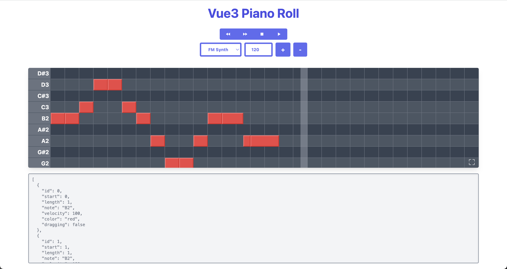

# Vue Piano Roll

[Vue Piano Roll](https://github.com/howardah/vue-piano-roll) is a flexible and efficient piano roll component built with Vue.js and Nuxt.js. It provides a user-friendly interface for creating and modifying musical notes that can be played back in real time. This repository hosts the demo application for this component. You can interact with the Piano Roll and listen to the output using ToneJs.



## Demo
To see the component in action, visit our live demo: [https://vue-piano-roll.netlify.app/](https://vue-piano-roll.netlify.app/)

## Features
- Interactive piano roll grid
- Real time playback using ToneJs
- Responsive design compatible with multiple devices and screen sizes
- Developed with Vue.js and Nuxt.js for optimal performance

## Local Setup
You can set up the project on your local machine by following these steps:

1. Clone the repository:
```
git clone https://github.com/howardah/vue-piano-roll-demo.git
```

2. Navigate to the project directory:
```
cd vue-piano-roll-demo
```

3. Install the dependencies:
```
npm install
```
or
```
yarn install
```

4. Run the project:
```
npm run dev
```
or
```
yarn dev
```
Now, you can access the demo at [http://localhost:3000](http://localhost:3000).

## License
This project is licensed under the MIT License - see the [LICENSE](LICENSE) file for details